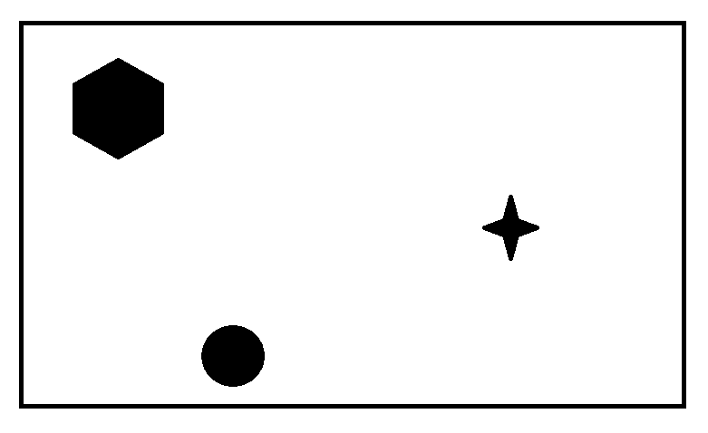
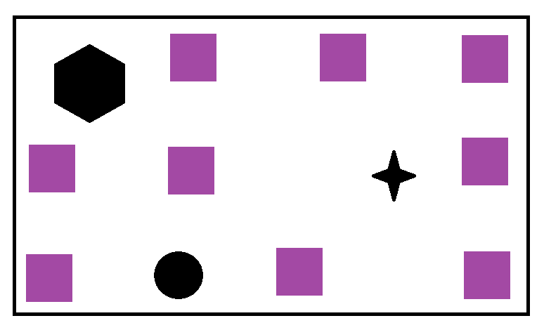

# Welcome to Zone Defender!

### Motivation

This library caters to a rather unique problem. Consider a rectangle, which has some obstacles in between it. Our motive here is to evenly distribute n number of uniform nodes arround the rectangle; with a condition that they should not overlap with obstacles. In essence, you can use this as an auto layout library.




<br/>

## Installation

This is a [Node.js](https://nodejs.org/en/) module available through the [npm registry](https://www.npmjs.com/).

Before installing, [download and install Node.js](https://nodejs.org/en/download/).

If this is a brand new project, make sure to create a `package.json` first with the [`npm init`](https://docs.npmjs.com/creating-a-package-json-file) command.

Installation is done using the [`npm install`](https://docs.npmjs.com/getting-started/installing-npm-packages-locally) command:

```sh
npm install zone-defender
```

## Parameters

> _All calculations should start from top left corner_

- `gridWidth`: horizontal width of outer area
- `gridHeight`: vertical height of outer area
- `boxWidth`: width of uniform nodes
- `boxHeight`: height of uniform nodes
- `forbiddenZones`: dimensions of tight rectangular zones encompassing obstacles
- `padding`: padding along the border of outer area

## Usage

> _You can use **first n** coordinates on first-come basis. They are already arranged to make our **n** nodes evenly distributed_

```javascript
import { getCoordinates } from "zone-defender"

const coordinates = getCoordinates(
	400,
	500,
	50,
	50,
	[{ top: 0, left: 0, width: 57, height: 57 }],
	6
)

//  [
//      { x: 306, y: 6 },   { x: 6, y: 406 },   { x: 306, y: 406 },
//      { x: 256, y: 6 },   { x: 306, y: 56 },  { x: 6, y: 356 },
//      { x: 306, y: 356 }, { x: 56, y: 406 },  { x: 256, y: 406 },
//  ...]
```

## Tests

To run the test suite, first install the dependencies, then run `npm run test`:

```sh
npm install
npm run test
```
